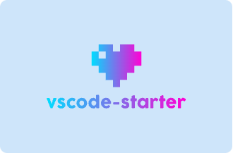

 English | <a href="./README_zh.md">简体中文</a>

vscode-starter is a template for quickly creating a vscode plug-in project. It can help you quickly create a vscode plug-in project, allowing you to focus on plug-in development.

<strong>Fake Coding</strong> 能让你双手离开键盘仍然表现出在 `coding` 的状态，当你开启时，会根据当前文本内容，从头开始逐字的写入，表现出一直在 `coding` 的状态，当你关闭或者切换到别的文件时，就会还原你之前的内容

## Installation

- [@vscode-use/utils](https://github.com/vscode-use/utils)

## :coffee:

[buy me a cup of coffee](https://github.com/Simon-He95/sponsor)

## License

[MIT](./license)

## Sponsors

  

